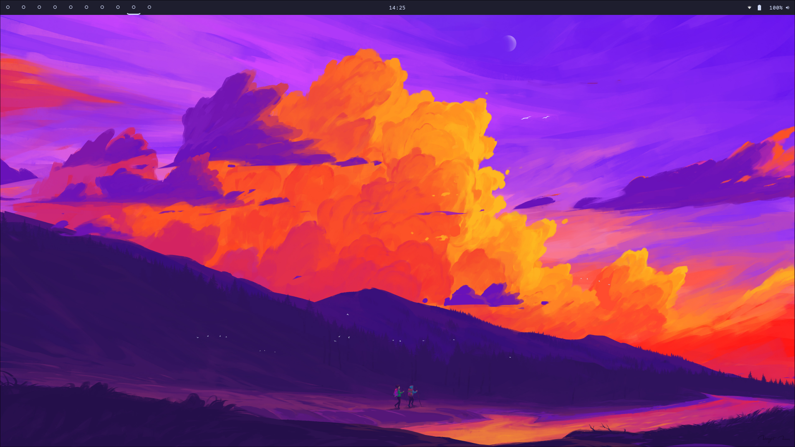
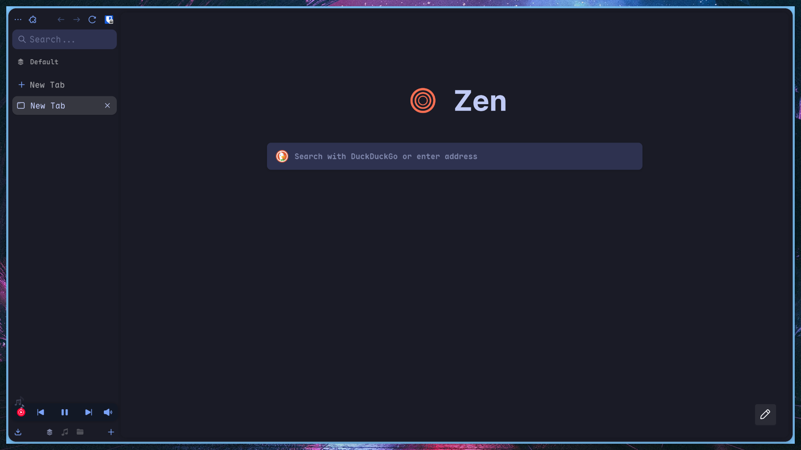

> [!CAUTION]
> Cuestionable code quality ahead.
> This might have to go after the re-write.

# Disguised Pigeon's NixOS Dotfiles

## _Preamble_

### How did we get here

I have been adding lots of stuff to my nixos config. At this point, the amount of tape holding the configs together got unmanageable. This was not evident up until the point I tried making the raspberry config. It basically meant a rewrite of the host modules using what were basically flags passed through from the specific system. This is usually a bad idea in programming, but for some reason felt more of a natural development on Nix. At this point, I stumbled upon flake-parts.

It promised a more feature-oriented structure. This could work... oh wait... I'm not ready for such a rewrite, I've got stuff to do outside of configuring... Let's keep rolling with this mess for a while.

So, rabbit-holing happened. Vimjoyer published a video about flake-parts. Right, but why would I just turn the flake into a flake-part if it's still a full system, this changes nothing. Am I crazy? I was crazy once. They locked me in a room, a rubber room. A rubber room with rats. Rats made me crazy... Crazy?- Oh that comment addresses it. "Flake parts doesn't really make sense until you use the dendritic pattern". More weird words in my nixos... I'm used to it at this point, first it was the "home manager" then the "flakes", "impurity", "impermanence", "direnvs"... Oh well, how bad can this one be to integrate... Oh... oh... fuck.

Welp, time to enter the dendritic niche of the flake parts niche within the nixos niche of the nix package manager niche.

Time to lambda some functions.

### Ok so WTH do all those words mean?

- Nix: Funny package manager. Through some environment hashing magic allows multiple versions of the same package to be installed, removing all dependency hell issues. It's implemented through the Nix language, which describes build instructions for the package.

- NixOS: Funny linux distro based around the Nix package manager

- Nixpkgs: Official nixos package repo. It's a collection of nix language programs.

- Flakes: Allows custom packages independent from the official nixpkgs repo and lockfiles for build reproducibility. Basically, it makes nix expressions always build exactly the same version and enables publishing custom packages outside of the official repo.

- Home manager: The Nix language can create any file, not just applications. Home manager allows per-user application installation **and** generation of configuration files on a per-user basis.

  > I can write my funny pretty colors in there without having everyone else have to use them.

- Stylix: Unified automatically applied appearance for every app. This means if I don't want to customize some app, I install it and by default it follows the theme I've applied to my system. It can be disabled in case I want more personalization.

- Dendritic config: Nix pattern, by the flake-parts library. It aims to make every file configure a single feature of a system/configuration.
  > For example, if I were to configure ssh I would write a `ssh.nix` file and make it contain a nixos and home-manager declaration which only configure ssh. That means:
  - Adding ssh to a system would be as simple as importing that file to the system.
  - Giving ssh permissions to a user would be, in the same way, adding that file to the user config.

## Config showcase

Nixos unstable dendritic config with standalone home manager.

> Am I a gatekeeper now?
> ...
> ...
> Nah.

### Images





### System Info:

- OS: NixOS
- DE: Hyprland, Niri, MangoWC(WIP).
- Shell: ZSH
- Terminal: Wezterm
- Editor: Neovim BTW

### Repo structure

- flake.nix: main flake definition - generated with [flake-file](https://github.com/).
- modules/: Nix modules, following the dendritic pattern - one file per-feature.
  - modules/_/_.nix: Name/Structure should be descriptive. Sorry if it's not.

### Instalation instructions

#### 0. Prerequisites

- Working NixOS installation.

#### 1. Installation

```sh
git clone https://github.com/DisguisedPigeon/nixos-dotfiles.git /home/.nixos-dotfiles #This is where I store it.
cd /home/.nixos-dotfiles
```

At this point, you may use this config as your own.

> [!TODO]
> Install instructions

something-something,

```sh
nixos-rebuild switch --flake .#{HOST}
```

something-something,

```sh
home-manager switch -b --flake .#{HOST}-{USERNAME}
```

#### 2. Daily life

If you want to add an input, use `flake-file` to install it in the module where you want to use it, remember running `nix run .#write-flake` after.

To update the flake use `nix flake update`.


Remember you can delete home-manager and NixOS generations if you are running out of disk space. You should have the config backed up on git anyways, so if something happens you can always restore the state through a live USB.

```sh
sudo home-manager expire-generations "$(date +%Y-%m-%d)"
sudo nix-collect-garbage --delete-old
```
The nix store is optimized and cleaned periodically if configured, but nix stores every bootable nixos generation and rollback-able home-manager config.

### Aditional notes

- This is a permanent WIP. Modularity should help fixing the changes I commit, but I would recommend forking as soon as you get to a point where you are happy with your current config to avoid breaking changes. The config is yours after all, why let me change it?
- I use NixOS BTW
- I will probably forget updating this readme (Indeed i did, LAST UPDATE: 19/10/2025, PREVIOUS: 09/05/2025). Installation success rate should stabilize now that the structure freezez, but be weary nontheless.
- There are probably some programs with incomplete configurations, either due to lazyness or me forgetting.
- I use NeoVim BTW
- I don't expect nobody to use this. It's probably better for you to use another better-maintained config. This is just my own, but if someone wants to use it, go ahead. I did, in fact, write this README for this purpose.
