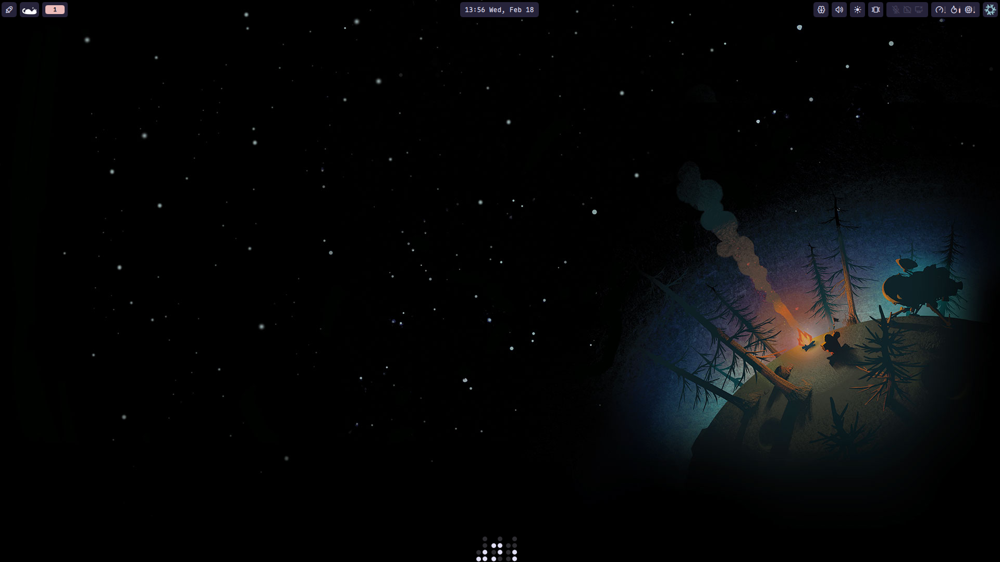
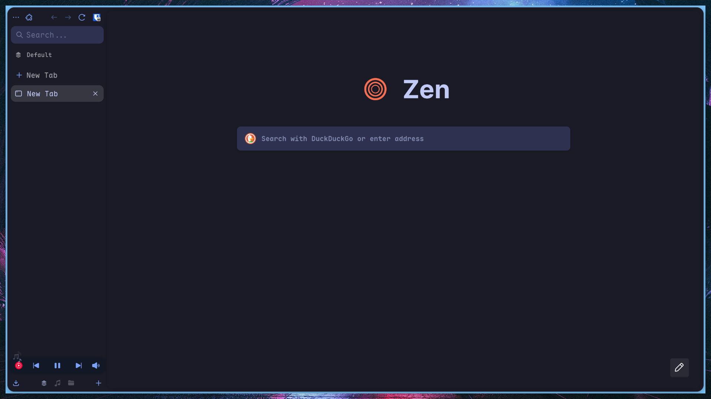

# Disguised Pigeon's NixOS Dotfiles

NixOS unstable dendritic-style config with standalone home manager (migrating to wrappers) buzzword buzzword.

### Images





### System Info:

- OS: NixOS
- DE: MangoWC + Noctalia-shell.
- Shell: ZSH
- Terminal: Wezterm
- Editor: Neovim BTW

### Repo structure

- flake.nix: main flake definition - generated with [flake-file](https://github.com/).
- modules/: Nix modules, following the dendritic pattern - one file per-feature.
  - modules/\_/\_.nix: Name/Structure should be descriptive. Sorry if it's not.
- packages/: Nix packages, including wrappers among others.

### Instalation instructions

#### 1. Installation

```sh
git clone https://github.com/DisguisedPigeon/nixos-dotfiles.git /home/.nixos-dotfiles #This is where I store it.
cd /home/.nixos-dotfiles
```

At this point, you may use this config as your own.

> ![NOTE]
> HOST is any hostname defined on modules/flake/systems.nix under flake.nixosConfigurations.  
> USERNAME is any user defined on modules/flake/users.nix under flake.homeConfigurations.

To apply the changes to the whole system, run:

```sh
nixos-rebuild switch --flake .#<HOST>
```

To apply the changes to the user config, run:

```sh
home-manager switch -b backup --flake .#{HOST}-{USERNAME}
```

#### 2. Daily life

You can add an app by creating a modules/community/\*.nix file and configuring it there. Either through [nixos options](https://search.nixos.org/options?channel=unstable), [home manager options](https://home-manager-options.extranix.com/?query&release=master) or by making a [nix-wrapper](https://github.com/BirdeeHub/nix-wrapper-modules) and installing it as a package on either nixos or home-manager.

If you want to add an input, use `flake-file.inputs.<name>` to install it in the module where you want to use it and run `nix run .#write-flake` after declaring it.

To update the system use `nix flake update` followed by a system rebuild.

Remember you can delete home-manager and NixOS generations if you are running out of disk space. You should have the config backed up on git anyways, so if something happens you can always restore the system by reinstalling.

```sh
nix-collect-garbage -d
nix shell github:jzbor/nix-sweep
```

The nix store is optimized and cleaned periodically if configured, but nix stores every bootable nixos generation and rollback-able home-manager config.

### Aditional notes

- This is a permanent WIP. Fork when you start using it or you will run into conflicts. Why would you let me change your config?
- I use NixOS BTW
- I will probably forget updating this readme (LAST UPDATE: Apr 9th 2026).
- I use NeoVim BTW
- I don't expect anybody to use this. Breakages may happen.

### WTH do all those words mean?

- Nix: Funny package manager. Through some environment hashing magic allows multiple versions of the same package to be installed, removing all dependency hell issues. It's implemented through the Nix language, which describes build instructions for the package.

- NixOS: Funny linux distro based around the Nix package manager

- Nixpkgs: Official nixos package repo. It's a collection of nix language programs.

- Flakes: Allows custom packages independent from the official nixpkgs repo and lockfiles for build reproducibility. Basically, it makes nix expressions always build exactly the same version and enables publishing custom packages outside of the official repo.

- Home manager: The Nix language can create any file, not just applications. Home manager allows per-user application installation **and** generation of configuration files on a per-user basis.

  > I can write my funny pretty colors in there without having everyone else have to use them.

- Stylix: Unified automatically applied appearance for every app. This means if I don't want to customize some app, I install it and by default it follows the theme I've applied to my system. It can be disabled in case I want more personalization.

- Dendritic config: Nix pattern, by the flake-parts library. It aims to make every file configure a single feature of a system/configuration.
  > For example, if I were to configure ssh I would write a `ssh.nix` file and make it contain a nixos and home-manager declaration which only configure ssh. That means:
  - Adding ssh to a system would be as simple as importing that file to the system.
  - Giving ssh permissions to a user would be, in the same way, adding that file to the user config.
