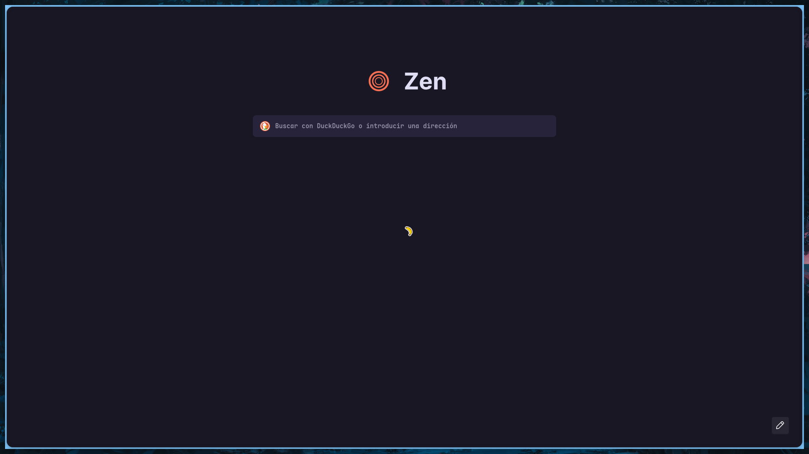

# Disguised Pigeon's NixOS Dotfiles

Nixos unstable dendritic-style config with standalone home manager buzzword buzzword.

### Images




### System Info:

- OS: NixOS
- DE: Hyprland, Niri, MangoWC(WIP).
- Shell: ZSH
- Terminal: Wezterm
- Editor: Neovim BTW

### Repo structure

- flake.nix: main flake definition - generated with [flake-file](https://github.com/).
- modules/: Nix modules, following the dendritic pattern - one file per-feature.
  - modules/\_/\_.nix: Name/Structure should be descriptive. Sorry if it's not.

### Instalation instructions

#### 0. Prerequisites

- Working NixOS installation.

#### 1. Installation

```sh
git clone https://github.com/DisguisedPigeon/nixos-dotfiles.git /home/.nixos-dotfiles #This is where I store it.
cd /home/.nixos-dotfiles
```

At this point, you may use this config as your own.

To apply the changes to the whole system, run:

```sh
# HOST is any hostname defined on Configs.nix under flake.nixosConfigurations
nixos-rebuild switch --flake .#{HOST}
```

To apply the changes to the user config, run:

```sh
# HOST is any hostname defined on Configs.nix under flake.nixosConfigurations
# USERNAME is any user defined on Configs.nix under flake.homeConfigurations
home-manager switch -b backup --flake .#{HOST}-{USERNAME}
```

You may change the name of any of these everywhere.

#### 2. Daily life

To add an app, create a new module and add two attributes, one for flake.modules.nixos and other for flake.modules.homeManager. There you can configure it. Feel free to ask if you have any questions.

If you want to add an input, use `flake-file` to install it in the module where you want to use it, remember running `nix run .#write-flake` after.

To update the flake use `nix flake update`.

Remember you can delete home-manager and NixOS generations if you are running out of disk space. You should have the config backed up on git anyways, so if something happens you can always restore the state through a live USB.

```sh
nix shell --impure github:jzbor/nix-sweep
# clean up nix roots across all the system
sudo nix-sweep tidyup-gc-roots
# delete old generations
sudo nix-sweep cleanout system --remove-older 1m
nix-sweep cleanout user --remove-older 1m
nix-sweep cleanout home --remove-older 1m
# collect garbage
nix-sweep gc
```

The nix store is optimized and cleaned periodically if configured, but nix stores every bootable nixos generation and rollback-able home-manager config.

### Aditional notes

- This is a permanent WIP. Modularity should help fixing the changes I commit, but I would recommend forking as soon as you get to a point where you are happy with your current config to avoid breaking changes. The config is yours after all, why let me change it?
- I use NixOS BTW
- I will probably forget updating this readme (Indeed i did, LAST UPDATE: 19/10/2025, PREVIOUS: 09/05/2025). Installation success rate should stabilize now that the structure freezez, but be weary nontheless.
- There are probably some programs with incomplete configurations, either due to lazyness or me forgetting.
- I use NeoVim BTW
- I don't expect nobody to use this. It's probably better for you to use another better-maintained config. This is just my own, but if someone wants to use it, go ahead. I did, in fact, write this README for this purpose.

### WTH do all those words mean?

- Nix: Funny package manager. Through some environment hashing magic allows multiple versions of the same package to be installed, removing all dependency hell issues. It's implemented through the Nix language, which describes build instructions for the package.

- NixOS: Funny linux distro based around the Nix package manager

- Nixpkgs: Official nixos package repo. It's a collection of nix language programs.

- Flakes: Allows custom packages independent from the official nixpkgs repo and lockfiles for build reproducibility. Basically, it makes nix expressions always build exactly the same version and enables publishing custom packages outside of the official repo.

- Home manager: The Nix language can create any file, not just applications. Home manager allows per-user application installation **and** generation of configuration files on a per-user basis.

  > I can write my funny pretty colors in there without having everyone else have to use them.

- Stylix: Unified automatically applied appearance for every app. This means if I don't want to customize some app, I install it and by default it follows the theme I've applied to my system. It can be disabled in case I want more personalization.

- Dendritic config: Nix pattern, by the flake-parts library. It aims to make every file configure a single feature of a system/configuration.
  > For example, if I were to configure ssh I would write a `ssh.nix` file and make it contain a nixos and home-manager declaration which only configure ssh. That means:
  - Adding ssh to a system would be as simple as importing that file to the system.
  - Giving ssh permissions to a user would be, in the same way, adding that file to the user config.
