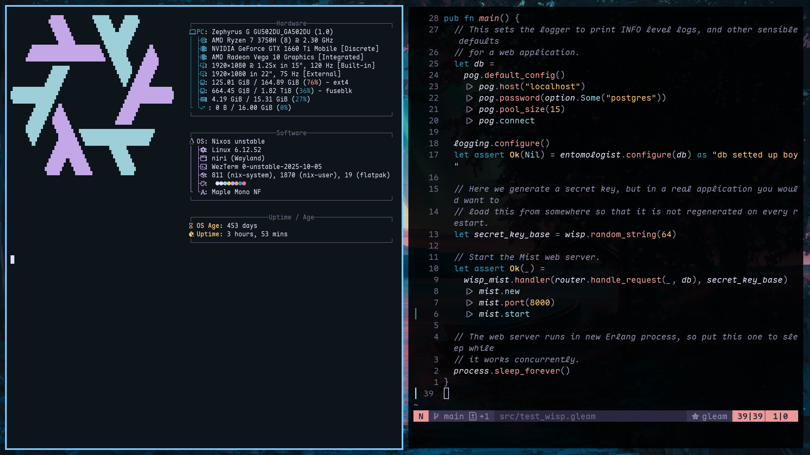

> [!CAUTION]
> Cuestionable code quality ahead.

# Disguised Pigeon's NixOS Dotfiles
Flake-based with unstable channels.

### Images




### System Info:
 - OS: NixOS
 - DE: Hyprland, awesomewm (unconfigured)
 - Shell: ZSH
 - Terminal: Wezterm
 - Editor: Neovim BTW

### Repo structure (might change)
 - flake.nix: flake definition (Describes channels to get packages from and sources configurations)
 - hosts/: System-wide configs. This includes user creation
 - home/: User-specific configs (with home manager).

### Instalation instructinos
#### 0. Prerequisites
 - Functioning NixOS installation.
 - flakes and nix-command enabled (view [configuration.nix](./host/modules/nix-setup.nix#L29), `nix.settings.experimental-features`).

#### 1. Installation
```sh
git clone https://github.com/DisguisedPigeon/nixos-dotfiles.git /home/.nixos-dotfiles #This is where I store it.
cd /home/.nixos-dotfiles
```
At this point, you may use this config as your own.

> [!WARNING]
> Before applying to your system, you should change:
> - [hardware-configuration.nix](./hosts/DPigeon-MacOS/hardware-configuration.nix) with your own  (should be autogenerated by NixOS when installing. Alternatively you can run
>   ```sh
>   nixos-generate-config
>   ```
>   which will generate it in `/etc/nixos/hardware-configuration.nix`
> - Switch the references to the nixos-hardware repo in the [configuration.nix](./host/DPigeon/configuration.nix#L4). You can select these by machine name or by part names as specified in the [flake](https://github.com/NixOS/nixos-hardware/blob/master/flake.nix)
> These are machine-specific

> [!NOTE]
> As I'm a comedy genius, I called my NixOS host DPigeon-MacOS, you may change it to whatever you prefer in the [flake](flake.nix) the system config folder and the [configuration file](./hosts/DPigeon-MacOS/configuration.nix#L27). You may also change it in the [home](./home) directory
> There are two users defined at this moment, [dpigeon](./home/DPigeon-MacOS/dpigeon) and [test](./home/DPigeon-MacOS/test) for the DPigeon-MacOS machine. You can also create new ones or change their names in the [flake](flake.nix), the [config file](./host/DPigeon-MacOS/configuration.nix) and the [per-user config](./home/DPigeon-MacOS/dpigeon/home.nix).
> The users should be reflected in all the files mentioned because of home-manager.
> 
> I also have defined an alias for dpigeon to apply nixos config (`nupdate`) and update the flake (`fupdate`) and another one for both users to apply home manager config (`hupdate`)

###### System update
```sh
sudo nixos-rebuild --flake .#DPigeon-MacOS switch
```
```sh
nupdate # Only as dpigeon
```
###### User home update
```sh
home-manager --flake .#dpigeon@DPigeon-MacOS switch
```
```sh
hupdate
```

###### Flake update
```sh
sudo nixos-rebuild --flake --upgrade .#DPigeon-MacOS switch
```
```sh
fupdate # Only as dpigeon
```

### Aditional notes
 - This is a permanent WIP, do not expect stability from anything I make. I've deleted my nvim config and re-wrote it like 3 times in the past. Also, I often forget to push stuff. Oopsie.
 - I use NixOS BTW
 - I will probably forget updating this readme (LAST UPDATE: 09/05/2025), so success rate will probably get worse with time
 - Unless in the future I update this, there probably are programs with incomplete configurations (also see first item). At the time of writing this, awesomewm is not configured at all. (I did update this, but awesomewm is still not done) (Still not done) (Once again not done, at this point I might just remove it)
 - I use NeoVim BTW
 - I don't expect nobody to use this, so if somebody is reading, I'm sorry for giving you the impression that installing this is a good idea. it's probably better for you to use another config (haven't tried it, but everything raexera makes is cool AF, so [raexera's yuki](https://github.com/raexera/yuki)).
